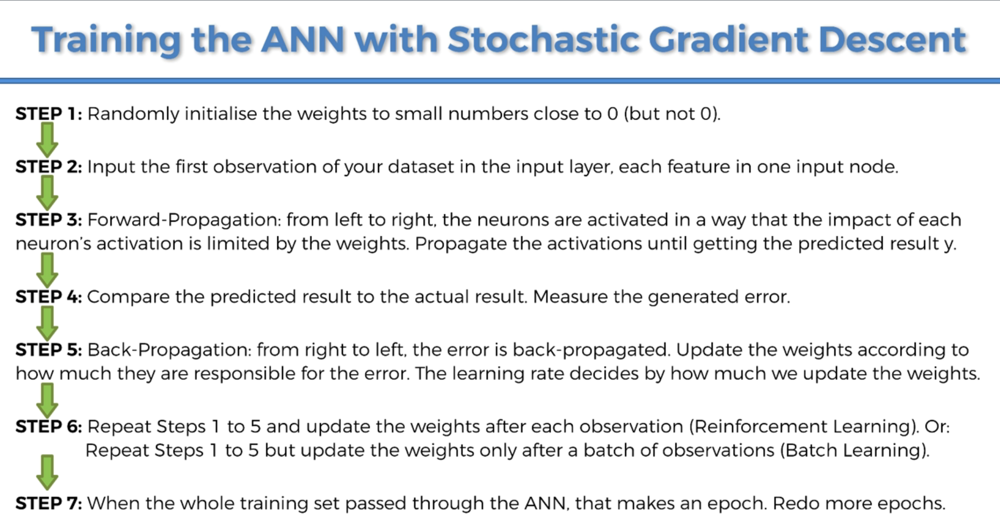
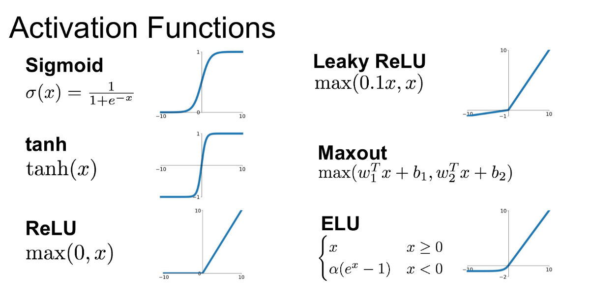
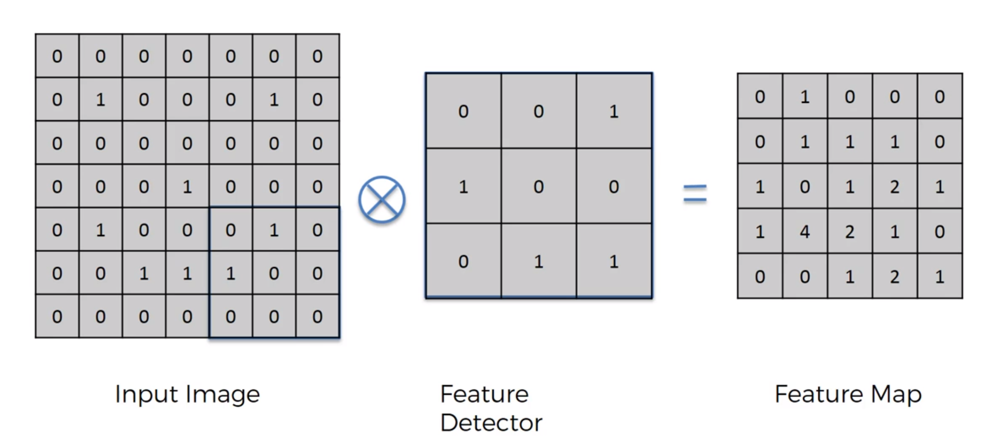
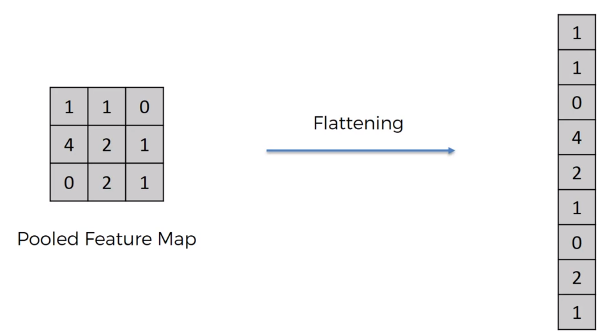
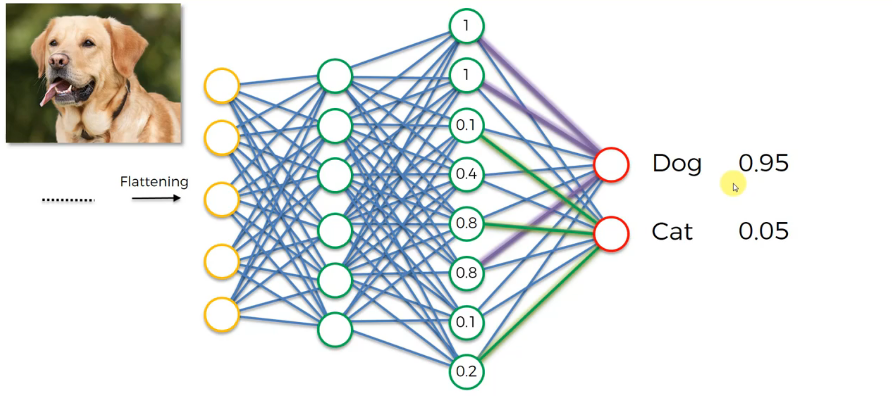
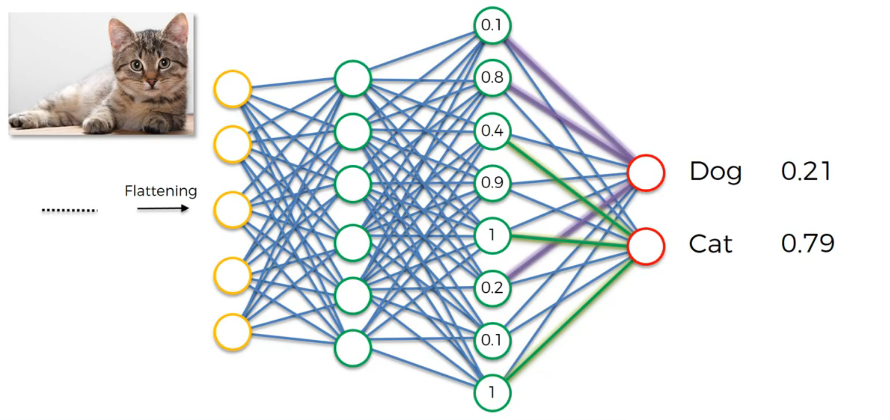

# Standard Scaling

* Standardization of a dataset is a common requirement for many machine learning estimators: they might behave badly if the individual features do not more or less look like standard normally distributed data (e.g. Gaussian with 0 mean and unit variance).

  

* For instance many elements used in the objective function of a learning algorithm (such as the RBF kernel of Support Vector Machines or the L1 and L2 regularizers of linear models) assume that all features are centered around 0 and have variance in the same order. If a feature has a variance that is orders of magnitude larger that others, it might dominate the objective function and make the estimator unable to learn from other features correctly as expected.

  

# Keras and Tensorflow

* Keras as a simplified API to TensorFlow

* Keras is a simple, high-level neural networks library, written in Python that works as a wrapper to Tensorflow[1] or Theano[2] . Its easy to learn and use.Using Keras is like working with Logo blocks. It was built so that people can do quicks POC’s and experiments before launching into full scale build process

* TensorFlow is somewhat faster than Keras

  

# Encoder

  

  

[Mupltiple encoding techniques Intro: label, one-hot, vector, optimal binning, target encoding](https://maxhalford.github.io/blog/target-encoding-done-the-right-way/)

  

  

[All encoder methods](https://towardsdatascience.com/smarter-ways-to-encode-categorical-data-for-machine-learning-part-1-of-3-6dca2f71b159) !!! IMPORTANT

  

***Summary:***

  

***Classic Encoders***

The first group of five classic encoders can be seen on a continuum of embedding information in one column (Ordinal) up to _k_ columns (OneHot). These are very useful encodings for machine learning practitioners to understand.

  

**_Ordinal_** — convert string labels to integer values 1 through _k_. Ordinal.

**_OneHot_** — one column for each value to compare vs. all other values. Nominal, ordinal.

**_Binary_** — convert each integer to binary digits. Each binary digit gets one column. Some info loss but fewer dimensions. Ordinal.

**_BaseN_** — Ordinal, Binary, or higher encoding. Nominal, ordinal. Doesn’t add much functionality. Probably avoid.

**_Hashing_** — Like OneHot but fewer dimensions, some info loss due to collisions. Nominal, ordinal.

  

 

  

***Contrast Encoders***

The five contrast encoders all have multiple issues that I argue make them *unlikely to be useful for machine learning*. They all output one column for each column value. I would avoid them in most cases. Their [stated intents](http://www.willmcginnis.com/2015/11/29/beyond-one-hot-an-exploration-of-categorical-variables/?source=post_page---------------------------)are below.

  

**_Helmert_** _(reverse)_ — The mean of the dependent variable for a level is compared to the mean of the dependent variable over all previous levels.

**_Sum_** — compares the mean of the dependent variable for a given level to the overall mean of the dependent variable over all the levels.

**_Backward Difference_** — the mean of the dependent variable for a level is compared with the mean of the dependent variable for the prior level.

**_Polynomial_** — orthogonal polynomial contrasts. The coefficients taken on by polynomial coding for k=4 levels are the linear, quadratic, and cubic trends in the categorical variable.

  

 

  

***Bayesian Encoders***

  

The Bayesian encoders use information from the dependent variable in their encodings. They output one column and can work well with high cardinality data.

  

**_Target_** — use the mean of the DV, must take steps to avoid overfitting/ response leakage. Nominal, ordinal. For classification tasks.

**_LeaveOneOut_** — similar to target but avoids contamination. Nominal, ordinal. For classification tasks.

**_WeightOfEvidence_** — added in v1.3. Not documented in the [docs](http://contrib.scikit-learn.org/categorical-encoding/?source=post_page---------------------------) as of April 11, 2019. The method is explained in [this post](https://www.listendata.com/2015/03/weight-of-evidence-woe-and-information.html?source=post_page---------------------------).

**_James-Stein_** — forthcoming in v1.4. Described in the code [here](https://github.com/scikit-learn-contrib/categorical-encoding/blob/master/category_encoders/james_stein.py?source=post_page---------------------------).

**_M-estimator_** — forthcoming in v1.4. Described in the code [here](https://github.com/scikit-learn-contrib/categorical-encoding/blob/master/category_encoders/m_estimate.py?source=post_page---------------------------). Simplified target encoder.

  

 

  

## Label encoding

  

Label encoding is simply converting each value in a column to a number, usually from test to numerical. For example, the `body_style` column contains 5 different values. We could choose to encode it like this:

  

- convertible -> 0

- hardtop -> 1

- hatchback -> 2

- sedan -> 3

- wagon -> 4

  

DISADVANTAGE:

The numeric values can be “misinterpreted” by the algorithms. For example, the value of 0 is obviously less than the value of 4 but does that really correspond to the data set in real life? Does a wagon have “4X” more weight in our calculation than the convertible? I don't think so.

  

## One-hot encoding

  

convert each category value into a new column and assigns a 1 or 0 (True/False) value to the column. This has the **benefit** of not weighting a value improperly but does have the downside of adding more columns to the data set.

  

## Target encoding

[Target encoding]([http://docs.h2o.ai/h2o/latest-stable/h2o-docs/data-munging/target-encoding.html](http://docs.h2o.ai/h2o/latest-stable/h2o-docs/data-munging/target-encoding.html))

  

Target encoding is the process of replacing a categorical value with the mean of the target variable. In this example, we will be trying to predict `bad_loan` using our cleaned lending club data: [https://raw.githubusercontent.com/h2oai/app-consumer-loan/master/data/loan.csv](https://raw.githubusercontent.com/h2oai/app-consumer-loan/master/data/loan.csv).

  

One of the predictors is `addr_state`, a categorical column with 50 unique values. To perform target encoding on `addr_state`, we will calculate the average of `bad_loan` per state (since `bad_loan` is binomial, this will translate to the proportion of records with `bad_loan = 1`).

  

For example, target encoding for `addr_state` could be:

  

|addr_state |average bad_loan|

|-------------|--------------|

|AK |0.1476998|

|AL | 0.2091603|

AR|0.1920290

AZ|0.1740675

CA|0.1780015

CO|0.1433022

  

**Instead of using state as a predictor in our model, we could use the target encoding of state.**

  

  

# Dummy Variables (one-hot encoding): One-hot encoding must apply in classifier

[Use of Dummy Variables](https://www.moresteam.com/WhitePapers/download/dummy-variables.pdf)

  

  

## Why one-hot encoding in classifier, not label encoding?

  

Because the **disadvantage of label encoding:** The numeric values can be “misinterpreted” by the algorithms. For example, the value of 0 is obviously less than the value of 4 but does that really correspond to the data set in real life? Does a wagon have “4X” more weight in our calculation than the convertible? I don't think so.

  

**This has the benefit of not weighting a value improperly but does have the downside of adding more columns to the data set.**

  

## Dummy Variable Trap:

The Dummy variable trap is a scenario where there are attributes which are highly correlated (Multicollinear) and one variable predicts the value of others. When we use one hot encoding for handling the categorical data, then one dummy variable (attribute) can be predicted with the help of other dummy variables. Hence, one dummy variable is highly correlated with other dummy variables. Using all dummy variables for regression models lead to dummy variable trap. **So, the regression models should be designed excluding one dummy variable.** (say, we have three, remove one of them)

  

# ANN training step

  

# Activation Functions:

  

  

### Rectifier (“I want to see only what I am looking for”)

### Sigmoid

### Softmax (Also known as “give-me-the-probability-distribution” function)

#### Example

#### Formula

  

# Keras

### Dense(): Choose number of nodes in the hidden layer

units = avg(# of nodes in the input layer, # of nodes in the output layer)

in which, 11 predictors and 1 response variable => (11+1)/2 => 6

  

### Choose activation function:

[Activation function cheetsheet](https://ml-cheatsheet.readthedocs.io/en/latest/activation_functions.html)

* Both **sigmoid (kill gradients; slow converage (vanishing gradient); ok in the last layer) and tanh functions are not suitable for hidden layers *(and avoid them)*** because if z is very large or very small, the slope of the function becomes very small which slows down the gradient descent which can be visualized in the below video.

* **Rectified linear unit (relu) is a preferred choice for !!*all hidden layers*!!** because its derivative is 1 as long as z is positive and 0 when z is negative. In some cases, **leaky rely can be used just to avoid exact zero derivatives (dead neurons but avoid overfitting).**

* **Softmax:** Use in **output layer** for classification In the case of multiclass specification, the actual class you have predicted will assemble in a value close to 1. And all other classes are assembled in values close to 0

* **Linear:** Use in **output layer** for regression

  

### Loss Functions: ?????????????

Cross-Entropy: Classification the decision boundary in a classification task is large (in comparison with regression)

  

MSE: Regression

  

### Gradient vanishing

Certain activation functions, like the sigmoid function, **squishes a large input space into a small input space between 0 and 1. Therefore, a large change in the input of the sigmoid function will cause a small change in the output.** Hence, the derivative becomes small. For instance, *first layer will map a large input region to a smaller output region, which will be mapped to an even smaller region by the second layer, which will be mapped to an even smaller region by the third layer and so on. As a result, even a large change in the parameters of the first layer doesn't change the output much.*

when n hidden layers use an activation like the sigmoid function, n smalJackie Chi Kit Cheung

l derivatives are multiplied together. Thus, **the gradient decreases exponentially as we propagate down to the initial layers.**

  

### Sigmoid vs Softmax

|Softmax Function| Sigmoid Function|

|-------|----------|

|Used for **multi-classification** logistic regression model|Used for **binary classification** in logistic regression model|

|The probabilities sum will be 1 | The probabilities sum need not be 1|

|Used in the different layers of neural networks| Used as activation function while building neural networks|

|The high value will have the higher probability than other values|The high value will have the high probability but not the higher probability|

  

  

## Overfitting

  

Def: While training the model, you can observe **some high** accuracy and **some low** accuracy so you have **high variance**

  

  

## Dropout Regularization

  

During training, some number of layer outputs are randomly ignored or “_dropped out_.”

  

Question: [Where should I place dropout layers in a neural network?](https://stats.stackexchange.com/questions/240305/where-should-i-place-dropout-layers-in-a-neural-network)

In the original paper that proposed dropout layers, by [Hinton (2012)](https://arxiv.org/pdf/1207.0580.pdf), dropout (with p=0.5) was used on **each of the fully connected (dense) layers** before the output; **it was not used on the convolutional layers**. This became the most commonly used configuration.

  

[More recent research](http://mipal.snu.ac.kr/images/1/16/Dropout_ACCV2016.pdf) has shown some value in applying dropout also to convolutional layers, although at much lower levels: p=0.1 or 0.2. **Dropout was used after the activation function of each convolutional layer: CONV->RELU->DROP.**

  

  

### One-hot encoding in classifier

  

MSE VS CROSS-ENTROPY

  

  

  

### In softmax classifier, why use exp function to do normalization?

[Because we use the natural exponential, we hugely increase the probability of the biggest score and decrease the probability of the lower scores when compared with standard normalization. Hence the "max" in softmax.](https://datascience.stackexchange.com/questions/23159/in-softmax-classifier-why-use-exp-function-to-do-normalization)

  

  

# CNN (Convolutional Neural Networks)

  

  

Input Image -> Feature Detector (Kernel or Filter) = **Feature Map** (how many pixels of Input pixels match Feature Detector matrix) (make the image smaller) (lose information but force on important features to us)

  

  

## Feature Detector/ Filter

Convolutional Neural Networks are (usually) supervised methods for image/object recognition. This means that you need to train the CNN using a set of labelled images: this allows to optimize the weights of its convolutional filters, hence learning the filters shape themselsves, to minimize the error.

  

Once you have decided the size of the filters, as much as the initialization of the filters is important to "guide" the learning, you can indeed initialize them to random values, and let the learning do the work.

  

  

  

### ReLU Layer, remove negative value of image

  

  

## Max Pooling

  

**Feature Maps** -> Extract the max value in the box (2X2 stride) -> **Pooled Feature Map**

  

1. Preserve the information but get rid of large portion of features, which are not important

2. Redure number of parameter of the finals in neural network

3. Avoid overfitting, disregarding the unnecessary information

  

  

  

## Sub-sampling/ Average pooling

**Feature Maps** -> Extract the average value in the box (2X2 stride) -> **Pooled Feature Map**

  

## Flattening

  

**Pooled Feature Map** -> Flattening, row by row -> long column -> neural nets

Overall Procedure:

## Full Connection

##
<!--stackedit_data:
eyJoaXN0b3J5IjpbMTIyODY0NjYzOSwxODEzNjEyMDk1XX0=
-->