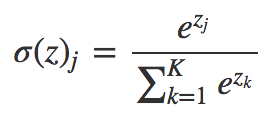

## Standard Scaling 
* Standardization of a dataset is a common requirement for many machine learning estimators: they might behave badly if the individual features do not more or less look like standard normally distributed data (e.g. Gaussian with 0 mean and unit variance).

* For instance many elements used in the objective function of a learning algorithm (such as the RBF kernel of Support Vector Machines or the L1 and L2 regularizers of linear models) assume that all features are centered around 0 and have variance in the same order. If a feature has a variance that is orders of magnitude larger that others, it might dominate the objective function and make the estimator unable to learn from other features correctly as expected.

## Keras and Tensorflow
* Keras as a simplified API to TensorFlow
* Keras is a simple, high-level neural networks library, written in Python that works as a wrapper to Tensorflow[1] or Theano[2] . Its easy to learn and use.Using Keras is like working with Logo blocks. It was built so that people can do quicks POC’s and experiments before launching into full scale build process
* TensorFlow is somewhat faster than Keras

## Label Encoding

Label encoding is simply converting each value in a column to a number, usually from test to numerical. For example, the  `body_style`  column contains 5 different values. We could choose to encode it like this:

-   convertible -> 0
-   hardtop -> 1
-   hatchback -> 2
-   sedan -> 3
-   wagon -> 4

## Dummy Variables (one-hot encoding): One-hot encoding must apply in classifier
[Use of Dummy Variables](https://www.moresteam.com/WhitePapers/download/dummy-variables.pdf)

### Why one-hot encoding in classifier

### Dummy Variable Trap: 
The Dummy variable trap is a scenario where there are attributes which are highly correlated (Multicollinear) and one variable predicts the value of others. When we use one hot encoding for handling the categorical data, then one dummy variable (attribute) can be predicted with the help of other dummy variables. Hence, one dummy variable is highly correlated with other dummy variables. Using all dummy variables for regression models lead to dummy variable trap. **So, the regression models should be designed excluding one dummy variable.** (say, we have three, remove one of them)

## ANN training step

## Activation Functions:

#### Rectifier (“I want to see only what I am looking for”)

#### Sigmoid

#### Softmax (Also known as “give-me-the-probability-distribution” function)
##### Example

##### Formula

## Keras 
#### Dense(): Choose number of nodes in the hidden layer
units = avg(# of nodes in the input layer, # of nodes in the output layer)
in which, 11 predictors and 1 response variable => (11+1)/2 => 6

#### Choose activation function:
[Activation function cheetsheet](https://ml-cheatsheet.readthedocs.io/en/latest/activation_functions.html)
* Both **sigmoid (kill gradients; slow converage (vanishing gradient); ok in the last layer) and tanh functions are not suitable for hidden layers *(and avoid them)*** because if z is very large or very small, the slope of the function becomes very small which slows down the gradient descent which can be visualized in the below video. 
* **Rectified linear unit (relu) is a preferred choice for !!*all hidden layers*!!** because its derivative is 1 as long as z is positive and 0 when z is negative. In some cases, **leaky rely can be used just to avoid exact zero derivatives (dead neurons but avoid overfitting).**
* **Softmax:** Use in **output layer** for classification In the case of multiclass specification, the actual class you have predicted will assemble in a value close to 1. And all other classes are assembled in values close to 0
* **Linear:** Use in **output layer** for regression

#### Loss Functions: ?????????????
Cross-Entropy: Classification the decision boundary in a classification task is large (in comparison with regression)

MSE: Regression

#### Gradient vanishing
Certain activation functions, like the sigmoid function, **squishes a large input space into a small input space between 0 and 1. Therefore, a large change in the input of the sigmoid function will cause a small change in the output.** Hence, the derivative becomes small. For instance, *first layer will map a large input region to a smaller output region, which will be mapped to an even smaller region by the second layer, which will be mapped to an even smaller region by the third layer and so on. As a result, even a large change in the parameters of the first layer doesn't change the output much.*

when n hidden layers use an activation like the sigmoid function, n small derivatives are multiplied together. Thus, **the gradient decreases exponentially as we propagate down to the initial layers.**

#### Sigmoid vs Softmax
|Softmax Function|	Sigmoid Function|
|-------|----------|
|Used for **multi-classification** logistic regression model|Used for **binary classification** in logistic regression model|
|The probabilities sum will be 1	| The probabilities sum need not be 1|
|Used in the different layers of neural networks| Used as activation function while building neural networks|
|The high value will have the higher probability than other values|The high value will have the high probability but not the higher probability|

#### One-hot encoding in classifier

QUESTION: WHY ONE-HOT IN CLASSIFIER
MSE VS CROSS-ENTROPY
<!--stackedit_data:
eyJoaXN0b3J5IjpbLTI4NTkzMjAwMCwtNzcyNzk0NDIzLDcxOT
U4ODIwMywxNjc0OTA1MTMwLDE3MDIzMTYyOF19
-->